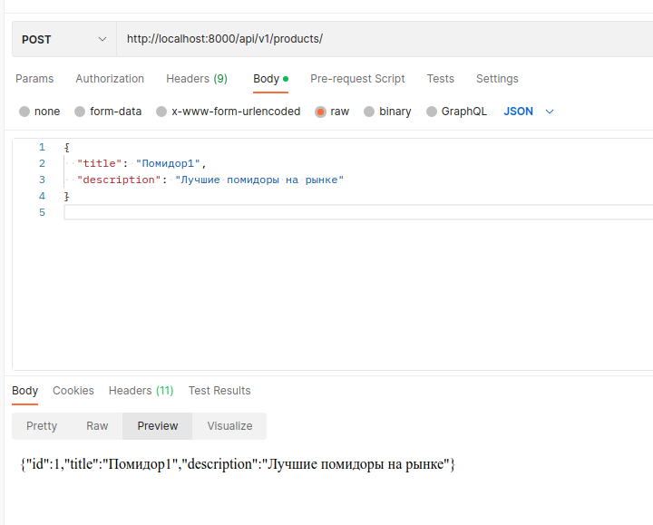
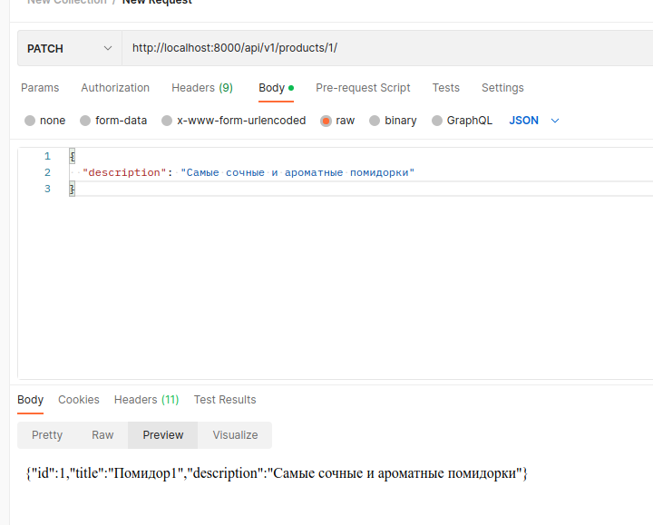
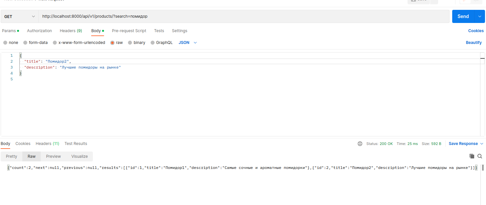

## Сборка образа

docker build --tag stocks_products .

## Запуск

docker run -d --publish 8000:8000 stocks_products

# Проверка работы  RestAPI  через PostMan

## Cоздание продукта

## Обновление продукта

## Получение продуктов

